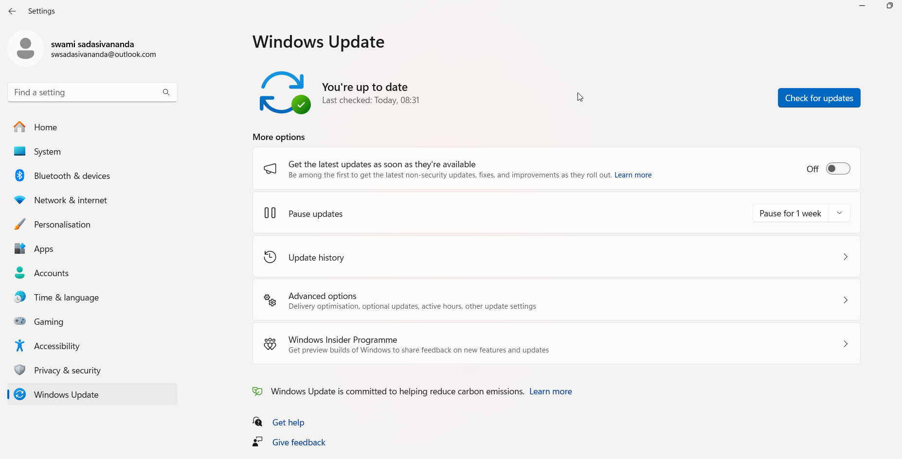
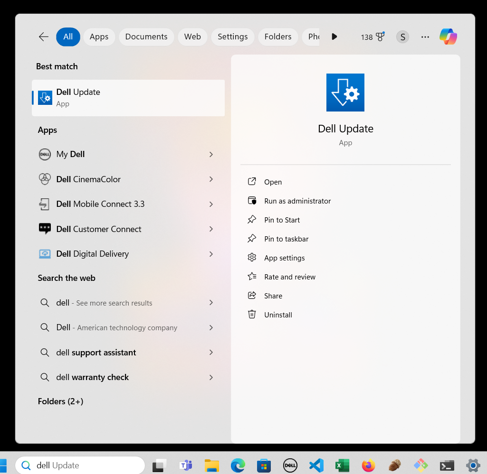

# Updates to Windows Laptop/Desktop

* Update to Windows OS software
* Updates to Dell/HP Software/Device Drives

## How to  update Windows?

* Make sure Laptop/desktop is connected with power supply and power is on
* Ensure internet is connected
* Type **update** as given below
* 
* Click on **Check for Updates**. The below screen would be displayed
* 
* Click **Check for updates**. After clicking, wait for few seconds and check the staus
  * **You're up to date** means that  **No new updates available from Microsoft**
  * The available updates for software programs will be listed and we can  **Download and Install Updates**

## How to update Dell?

* Make sure Laptop/desktop is connected with power supply and power is on
* Ensure internet is connected
* Type **dell** as given below
* 
* Click **Check** as given below
* 
* If any updates are there, it would be listed. **Select the updates** as given below and Click **Install**
* Click on - **Automatically restart system (when required)**
* 
* 
* 
* Finall click **Restart**
  