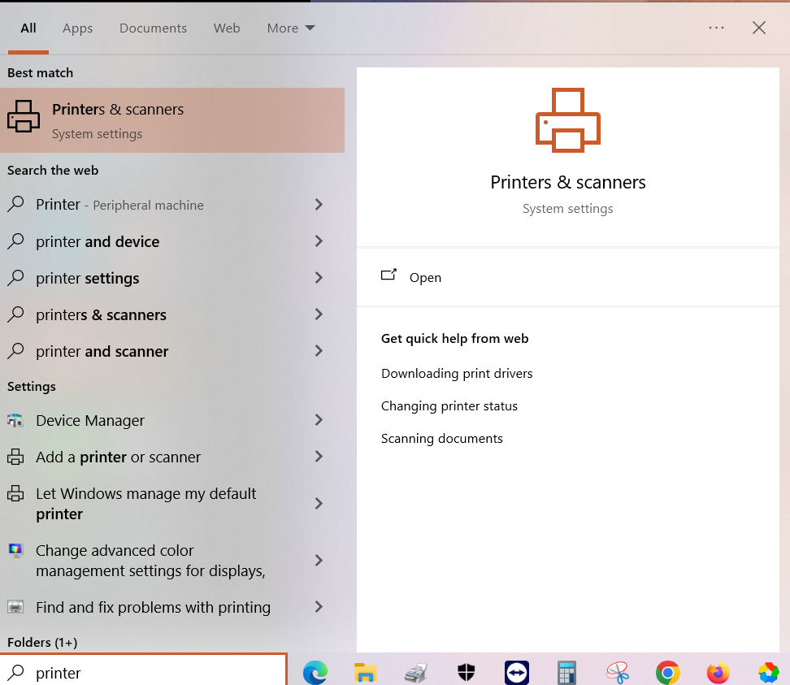
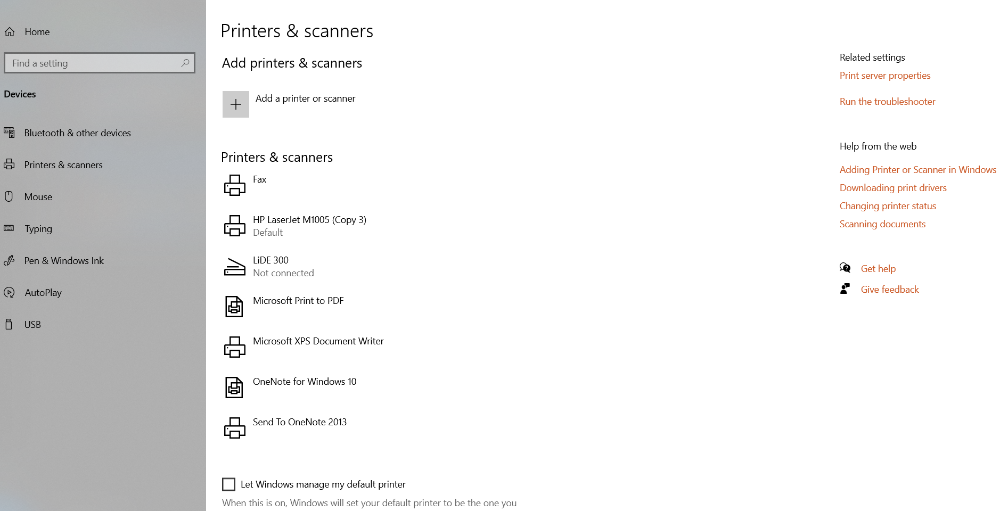
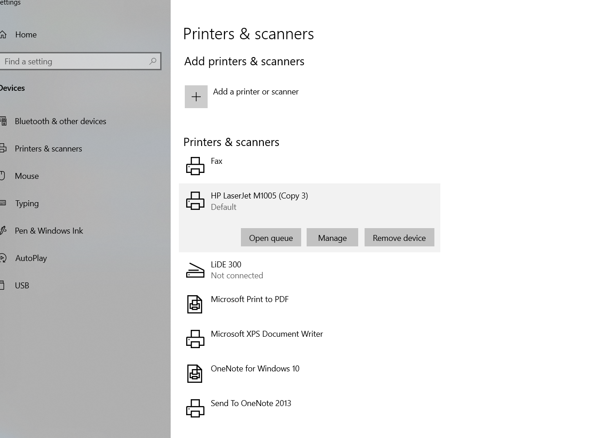
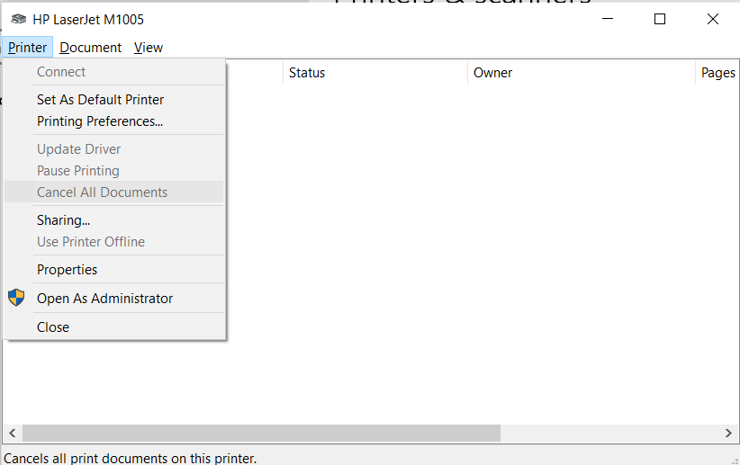

# Printer Troubleshooting

* Delete/Cancel all pending print jobs
* Remove/clear any stuck paper inside the printer by opening the printer
* Delete all printers
* Restart print spooler service
* Reinstall the printer driver
* Restart the System

## Windows - Printer Settings

* In **Type here to search**, type: **Printer** as given below

* Click on **Printers & Scanners**. It opens the below Printer settings

## How to Cancel all printer jobs

* Click on **HP LaserJet M1005** or **HP LaserJet M1005 (Copy 3)**

* There are three options
  * **Open queue**
  * **Manage**
  * **Remove device**
* Click on **Open queue** to view any pending/stuck print jobs
* It opens the below screen

* Click **Cancel all documents** to cancel the printing of all the documents
* Wait until all documents are removed from this screen
