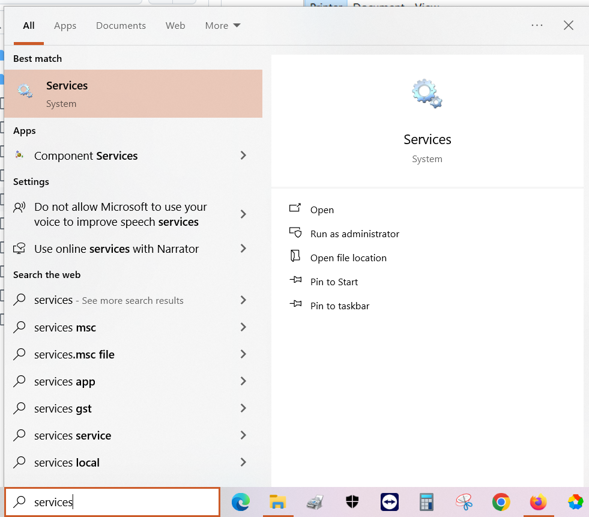
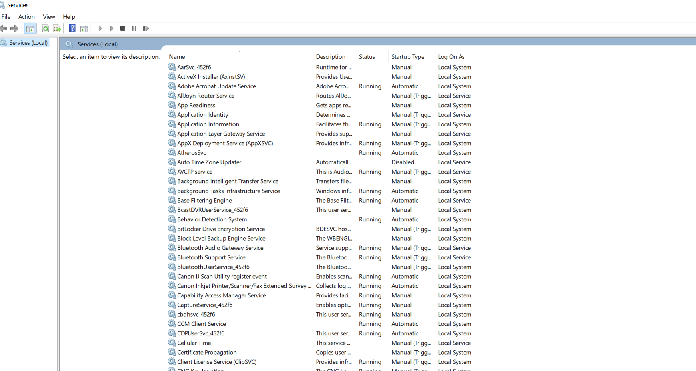
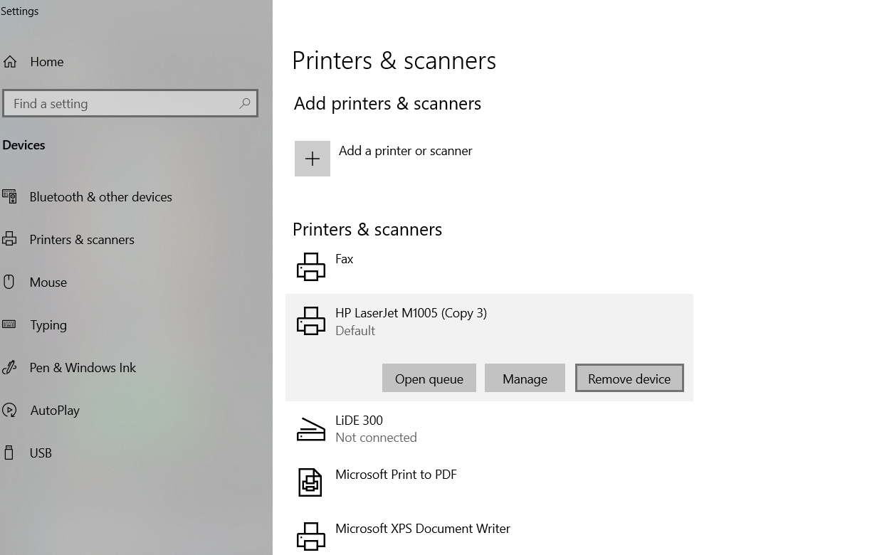

# Printer Troubleshooting

* Delete/Cancel all pending print jobs
* Remove/clear any stuck paper inside the printer by opening the printer
* Restart print spooler service
* Delete the printer
* Download (if not already downloaded) and Reinstall the printer driver
* Restart the System
* Add a printer or scanner from Printer Settings

## Windows - Printer Settings

* In **Type here to search**, type: **Printer** as given below

* Click on **Printers & Scanners**. It opens the below Printer settings

## How to Cancel all printer jobs

* Click on **HP LaserJet M1005** or **HP LaserJet M1005 (Copy 3)**

* There are three options
  * **Open queue**
  * **Manage**
  * **Remove device**
* Click on **Open queue** to view any pending/stuck print jobs
* It opens the below screen

* Click **Cancel all documents** to cancel the printing of all the documents
* Wait until all documents are removed from this screen

## Restart the printer spooler service

* In **Type here to search**, type: **services** as given below

* Click **Services**. It opens the below screen

* Look for **Print Spooler** as given below

* Right Click **Print Spooler** as given below and then click **Restart**

## Delete the printer

* Go to **Printer Settings**
* Select the printer **HP LaserJet M1005** or **HP LaserJet M1005 (Copy 3)**
* Click **Remove Device** to remove the printer

## Download (if not already downloaded) and Reinstall the printer driver

## Add a printer or scanner from Printer Settings

