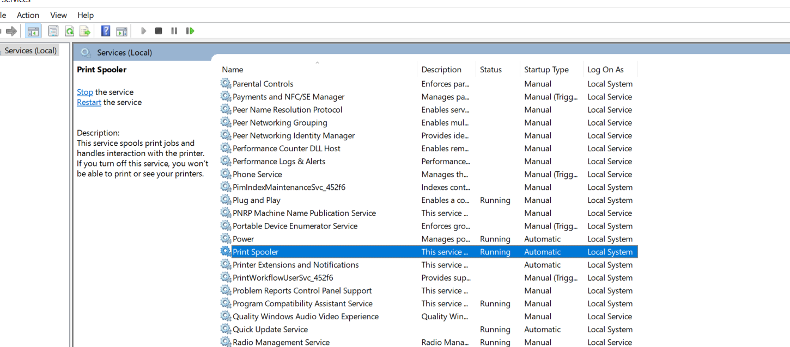
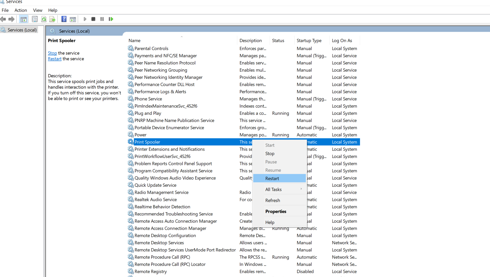

# Printer Troubleshooting Steps

* **Step 1** Delete/Cancel all pending print jobs
* **Step 2** Remove/clear any stuck paper inside the printer by opening the printer
* **Step 3** Restart print spooler service
* **Step 4** Delete the printer
* **Step 5** Download (if not already downloaded) and Reinstall the printer driver
* **Step 6** Restart the Computer
* **Step 7** Restart the Printer
* **Step 8** Check Printer in Printer settings
* **Step 9** Print Test Page

## Step 1 - Delete/Cancel all pending print jobs

* In **Type here to search**, type: **Printer** as given below

* Click on **Printers & Scanners**. It opens the below Printer settings

* Click on **HP LaserJet M1005**

* There are three options
  * **Open queue**
  * **Manage**
  * **Remove device**
* Click on **Open queue** to view any pending/stuck print jobs
* It opens the below screen

* Click **Cancel all documents** to cancel the printing of all the documents
* Wait until all documents are removed from this screen

## Step 2 - Remove/clear any stuck paper inside the printer by opening the printer

## Step 3 - Restart print spooler service

* In **Type here to search**, type: **services** as given below

* Click **Services**. It opens the below screen

* Look for **Print Spooler** as given below

* Right Click **Print Spooler** as given below and then click **Restart**

## Step 4 - Delete the printer

* Go to **Printer Settings**
* Select the printer **HP LaserJet M1005**
* Click **Remove Device** to remove the printer as given below

## Step 5 Download and Reinstall the printer driver

* Software is downloaded and available in **`D:\printer-software`** - *HP_Printer_LJM1005_Full_Solution.exe*

* Double click **HP_Printer_LJM1005_Full_Solution.exe**

* Click **Yes**

* **hp** will be displayed in **Windows Task bar**

* Click on **hp**

* Click  **Add/Repair**

* Click **Repair**. Then click **Next**

* This will install the printer software. Finally installation complete message would be displayed as below

* **A System Reboot is required** window would be displayed as below. Click **Yes** in this window

## Step 6 Restart the Computer

## Step 7 Restart the Printer

## Step 8 Check Printer in Printer settings

* In **Type here to search**, type: **Printer** as given below

* In **Printers and Scanners** window, **HP LaserJet M1005** should be displayed

* Click on **HP LaserJet M1005**. In this Click **Manage**

* Click on **HP LaserJet M1005**. In this Click **Set as default**

## Step 9 Print Test Page

* Load paper in printer tray
* Print a test page

